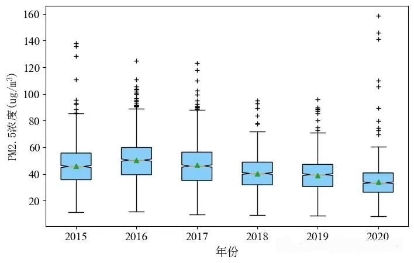

数据分析的概念都不陌生，在我们大学时候的数据报告、年底工作业务总结、社会上的各行各业的发展都离不开数据。数据分析的广泛适用性、未来发展的引导性使得数据分析在社会生产、科学研究中持续火热。由于数据分析概念比较模糊，有必要对数据分析的理论和过程进行简单的梳理，对数据分析有更为深刻的认识。
## 数据分析的概念

数据分析是指利用适当的统计分析方法对收集来的数据进行分析，最大化地挖掘数据包含的直接信息和间接信息。数据分析的目的是为了提取有用信息、形成结论而对数据进行研究和总结的过程。——概念参考来源：《百度百科》

从以上描述可以看出，数据分析由两部分组成：统计分析方法（模型）、数据；目的是挖掘数据信息，同样包括了两部分：直接信息、间接信息。

这就要求我们掌握以下技能：模型认知和应用、数据鉴别、信息挖掘。

模型认知和应用：要求我们理解模型的应用场景，例如：SVM和PCA、K-means和Random Forest等等。对于模型的认知和应用，我们可以通过：模型的类别（数据预处理与建模）、模型的作用（降维、统计分析、标准化等）这两大方面来理解。

| 模型名称 | 类别 | 应用场景 |
| ---- | ---- | ---- |
| PCA   | 数据预处理| 存在冗余特征，需要降维处理 |
| SVM | 建模分析 | 分类问题 |

我们可以知道，PCA的结果可以用于SVM的分析。在实际的工作和科研中，我们要分清楚模型的类别和应用场景。对属于同一类别的模型进行归类，例如：PCA，z标准化都属于数据预处理范畴。当我们进行数据预处理，就要想到应该使用什么预处理模型合适。

数据鉴别是数据分析中十分关键且容易忽略的一个环节，尤其是对于从事专业研究人员而言，若数据来源较少，使得他们对数据倍加珍惜，遇到觉得有用的数据就要收藏。但在整个过程中我们十分需要注意数据的质量，简单来说就是要有权威的数据来源。例如对于中国地图数据，网上搜索随处可见数据源，但是最权威、最有效的还是来自中国自然资源部的数据。收集数据既要保证质量、也要保证使用最新的数据（或近些年、其他权威机构发布的数据）。

数据挖掘是数据分析的核心环节，如何从众多数字找到规律？常见的方式有：表格、各种图表等。制作图表是容易的，但是说明图表包含的信息却很难。表层信息我们可以容易看出，但是图表背后的信息，如导致某种现象的背后驱动因子等分析，是更为困难和重要的，这需要专业的知识和领域从事的经验判断，这也是新手数据分析师和老手数据分析师的区别。

怎么进行数据挖掘呢？下面举个例子：下图是全国站点2015-2020年年均站点PM2.5箱型图。从哪些角度挖掘信息呢？

直接信息：从图的组成要素来解释，也就是叙述图表是什么

（1）从中位数来看，2015—2020年中位数、平均值呈现下降趋势，表示空气质量改善。

（2）箱体的高度：代表了25%—75%的数据分布，相当于这其中包含了50%的数据，箱体越窄表示空间范围内站点污染差异值越小。这就表明2015—2020年全国站点的差异性降低，地区分异性降低。

（3）离群值上：箱须上方的"+"代表异常值（离群值），在这里表示年均站点过高的值。可以看出2015—2020年异常值并没有降低。说明在全国PM2.5降低背景下，某些站点的污染仍居高不下。

潜在信息：从图呈现规律性的背后原因分析，也就是寻找为什么

（1）为什么平均值、中位数出现逐年下降的趋势？从政策上看，自从我国实行严格的减排以后，我国对机动车、高排放工厂监管更加严格，这是导致PM2.5浓度下降的重要原因。

（2）为什么2020年异常值要比2015年更多？这似乎与上一个结论矛盾。事实上，我们可以从PM2.5产生的原因进行推测。我国高值PM2.5主要出现在华北平原、四川盆地、新疆地区，这三个地区产生的原因各不相同。政策的实施主要是控制人的行为来解决，而自然原因导致的污染是很难解决的。因此可以大致判断出2020年高值主要是由自然原因形成，且随着全球变化，极端天气增加，出现中位数、平均值降低而异常值增加的情况。

（3）除了从图上直接获取信息外，由于箱型图展现了样本统计的最小值、下四分位数、中位数、平均值、上四分位数、最大值指标，我们还可以通过制表的方式将2015-2020年数据在上述几个维度上对比，定量分析它们的变化，使得数据分析更加精确。

### THE END

本节主要介绍了数据分析的概念，了解数据分析的两个组成部分和数据分析的目的，并通过一个实例来说明如何挖掘图表的直接信息和间接信息。
