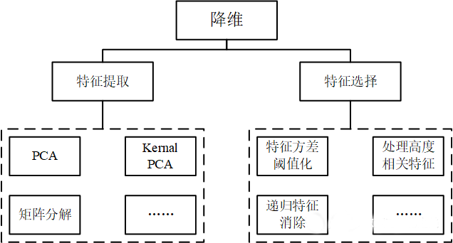

## 数据分析中的一些“坑”

1）明确分析目的

2）数据质量管理和建议

3）统计模型选择与应用

4）关于显著性检验的提醒

#### 分析目的要贯穿整个工作流程，不要偏离分析目标

#### 数据质量要注意数据的来源权威性、无偏性和排除规则

#### 模型纷繁复杂，要根据分析目的和模型对数据的要求选择模型；显著性检验在python中比较隐秘，需要日常积累。

###  时刻明确分析目的
话听起来很简单，做起来可没那么容易。回想做毕业设计，刚开始我们有了一个明确的flag，可是在中间过程却越偏越远。

数据分析可以分解成若干个环节的总和，当我们做某一环节的工作时，要时刻牢记这一环节的目的是什么？它对我们目标起的作用又是什么？不要做对我们目的无意义的事，时刻牢记我们的分析目标，不要偏离路线！！！

###  数据质量管理
在学术界有这么一句话“Garbage in，garbage out”，大致意思是输入垃圾一样的数据，输出的结果也是一堆垃圾。强调了数据质量的重要性。

Garbage in主要针对数据收集阶段，主要包括：
1）抽样偏差：针对社会调查而言，获取的样本不能代表总体。以调查问卷为例，受访者的性别比、年龄等都是需要考虑的，如果年轻群体样本过多，就无法代表老年群体的真实情况。
2）数据来源：对于直接从网上获取的数据，需要更加小心，了解我们该专业/行业的权威数据网站十分有必要。
3）排除规则：无论是社会调查还是网上获取数据，都会存在异常值，设置一个合理的排除规则是一个值得考虑的事。理想情况下，获取的数据应该大致符合正态分布，为了剔除那些出现概率极低的异常值，需要设置一个排除规则，如3倍标准差原则。

如何保证数据质量？这里有几个方法可供参考：
1）查找本领域的相关研究，他们大多都标注了数据来源，根据提供的信息直接查找即可。
2）咨询他人以了解本领域常用的几个权威数据网站，并注意收藏。
3）培养储存数据意识，将已获取的数据保存起来，说不定某个时刻你就会用到。
4）掌握常见的数据排除规则，例如三倍标准差、箱型图等判别方式，都是很常用的。

### 统计分析方法的选择与应用
模型种类纷繁多样，在统计分析方法步骤中有两个需要注意：模型选择、数据适用性。
#### 1、模型选择
以降维为例，则肯定选择与降维有关的模型，其实降维模型也有很多，如下图：

根据我们的目的，如果想要制作CCA图，则需要特征提取，如果追求更高的解释性，则需要特征选择。

在特征提取范围内，如果数据线性不可分，则选择核PCA(Kernal PCA)，因为标准PCA使用线性映射减少特征数量，如果数据线性不可分，标准PCA的结果可能没那么好。通过一系列的判断可以帮助我们选择适合当前目的的较好模型，而不是随意选择。

#### 2、数据适用性
就如1中所述，不同的模型对数据的要求也不同。有的模型适合分类，有的模型适合回归；有的模型要求数据符合正态分布（事实上，大多数的机器学习模型都有这个条件），有的模型则没有要求（如LightGBM）。在确定一个模型时，我们需要详细了解它们对数据的要求，以免得出错误的结论。

### 显著性检验

对于大部分人而言，显著性检验是既熟悉又陌生的一个概念。在研究性论文中，我们经常遇到训练一个模型后，需要计算模型及系数的p值。它主要作用是表征这个模型/系数的可信度，如果没有p值，模型可能是有偏差的，不能代表普遍情况。

但是根据我接触的机器学习模型，大多数没有自带p值的计算，因此在使用python进行数据分析建模时，需要额外注意显著性检验的方式。

相关分析、多元线性回归时验证p值，检验样本分布时验证t值。还要注意并不是所有的p<0.05都可认为万事大吉。例如在因子分析中，如果Bartlett's球形检验的p<0.05，表明变量之间相互独立，不适合因子分析。所以我们还要了解在不同模型中p值代表的意义，到底是<0.05还是>0.05才能满足我们的要求。

### THE END

本节主要数据分析中需要注意的几个坑，主要有：时刻牢记分析目的、数据质量管理及方法、模型选择与应用中需要注意的问题、显著性检验的重要性。

