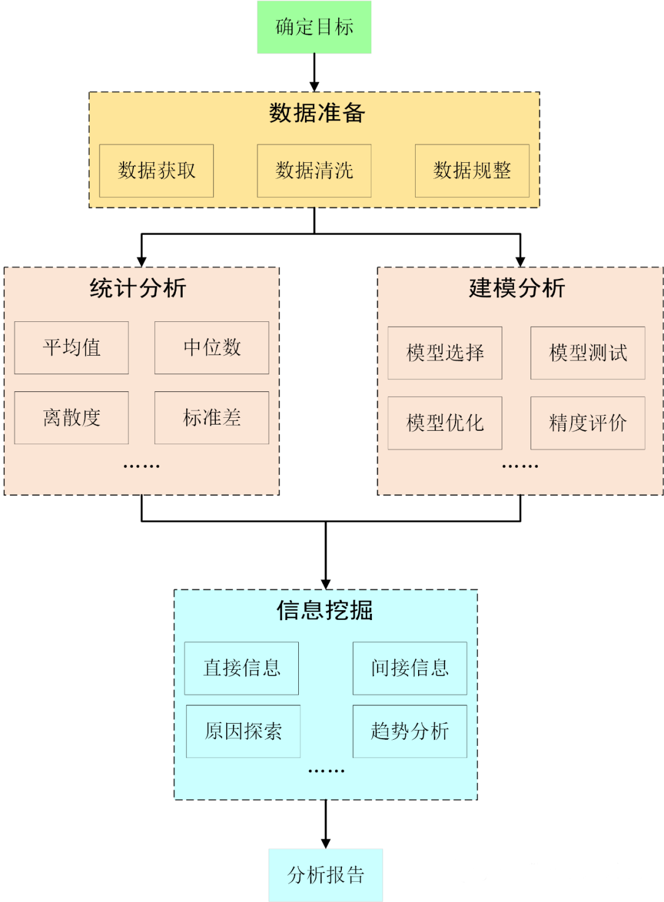
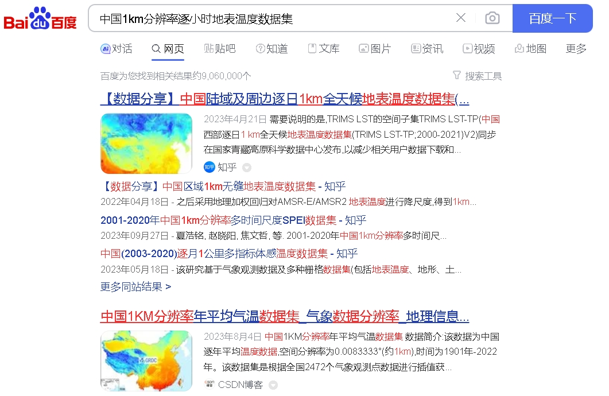
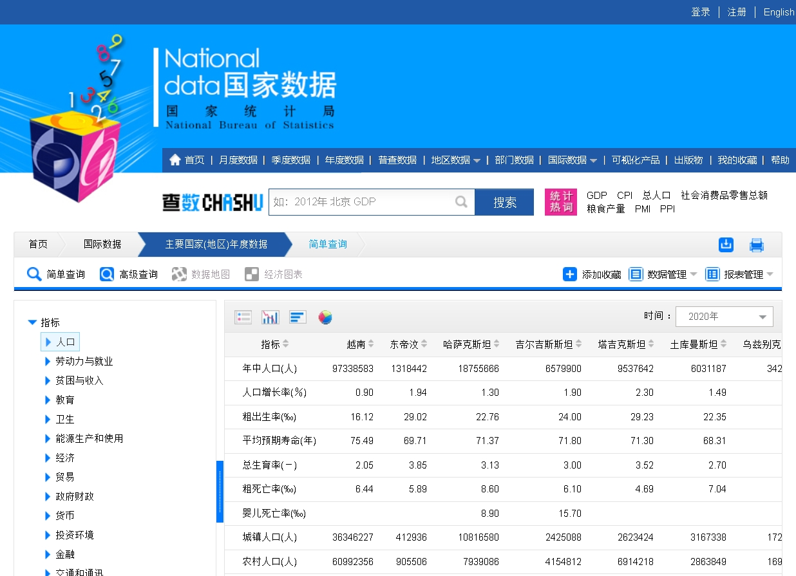
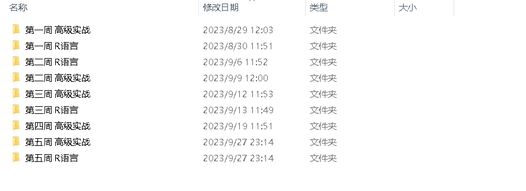

### 数据分析的基本流程

如何做好数据分析

可以大致看出数据分析分为5个步骤：

#### Step1：目标确定
目标大部分是由甲方、客户或上级要求确定，但在第一次的数据报告中，需要我们自己确定目标，完成后经过审阅，可以再适当修改。在这个阶段，我们需要注意几个方面：

（1）尽量选择一个自己比较擅长/感兴趣的学科领域

（2）选择该学科领域的某一个或几个具体的研究方向

（3）了解研究方向中常用的研究方法、公开/可获取的数据

自己比较擅长/感兴趣的领域可以让我们了解事物的本质和一般的发展规律。如果选择合适，我们就比普通的数据分析者更有可能写出有深度的数据分析报告。

选择具体的研究方向可以让我们有一个明确的脉络，而不是一味地堆砌数据。什么样的目标收集什么样的数据，无关的数据收集不仅耗费我们的精力，还会对数据分析造成干扰。

了解常用的研究方法可以让我们快速入手某一个方向的实际操作；提前了解数据的可得性是我们进行数据分析的基础。

#### Step2：数据准备

##### 2.1数据获取

目标定下来后就需要获取数据了，实际上第一步中已经了解了自己所在研究方向上所需的数据来源。现实情况是很多人到这一步仍然不知道使用什么数据，如果确实不清楚，就再重新思考我们的选题。

当然，也有一些通用的数据获取方法：
（1）搜索引擎输入关键词，例如要找1km逐小时地表温度数据，可以搜索“中国1km分辨率逐小时地表温度数据集”，结果如下：

其中的第一个结果，就是我们要找的数据，点进去就可以发现能够免费下载全国1km逐小时温度数据集，数据来自“中国科学院西北生态环境资源研究院”，保证了数据的权威性。

（2）通过官方的统计局网站获取，可以保证数据的权威性。例如国家统计局发布的有逐年国内生产总值数据，我们可以将数据复制粘贴到Excel中。

但是大部分情况下，我们在搜索引擎中可能找不到需要的数据，不可否认的是，搜索结果中经常会给我们带来数据存在的一些线索，要善于运用浏览器。

（3）数据打包网站或者数据采集平台获取。例如淘宝有关于数据付费下载服务，对于网页版的大数据采集，也有一些平台支持类似爬虫的数据获取功能。

（4）自行收集数据：通过分发调查问卷、在线填写问卷、手工复制数据也都是可以的。但是这种方法用的比较少，比较耗费人力物力。

在数据收集阶段我们一定要保证数据的安全，不得随意获取使用用户隐私数据、不可散播非公开数据，是数据分析的基本道德要求，使用数据时注明数据来源。
##### 2.2数据清洗
几乎所有收集到的数据都需要对数据进行处理，使之符合数据分析的要求。数据清洗包括但不限于剔除空值、异常值、重复值等。这项繁琐复杂的工作要占据数据分析至少一半的时间，但这又是必需的工作，需认真对待。

日常数据分析中，我们要积累一些常见的数据清洗方法，例如剔除异常值，可以直接使用3倍标准差判别；重复值和空值可以通过Excel很方便地实现。熟悉这些操作可以大大简化工作量，节约我们的时间。

#####  2.3数据规整
数据规整就是把数据按照一定的规则进行排列和存储。每个人都知道，但是却很难做好的工作。笔者见过不少伙伴，包括笔者本人在存储数据时，有时候也会是一团乱麻，这使得在找想要的数据时需要花费不少时间，很令人恼火。

我们完全可以建立一个文件夹，将数据分类存放，如下图，可以很方便的找到某一次对应的数据：

对于文件内部的数据，可以对数据格式进行美化，例如：新建列名称、统计平均值、分组统计等等来使得数据情况一目了然。
#### Step3：描述分析

##### 3.1 统计分析

统计分析是数据分析中最广的分析方法。统计分析就是对数据进行文字描述和指标统计。

文字描述：对数据的基本属性进行刻画，例如空间范围、时间跨度、时间分辨率、空间粒度、数据来源、数据量等。

指标统计：用以了解数据的形态和分布状况，例如：平均值、中位数；标准差、极差等。反映数据变化范围和集中程度，彰显数据的特征。

趋势分析：通过对数据的时间序列变化或空间范围变化来推测数据的趋势，如增长率、覆盖面积等，来分析数据的变化趋势。

##### 3.2 建模分析

建模主要是根据已有的数据选择特定的模型来对数据进行预测或评价，各行各业都有自己常用的数学分析模型。具体该用哪些模型，在第一步就已经有所涉及。一个思路是我们可以参考别人的工作来总结该研究方向常用的模型，具体的介绍在上一节有具体实例，感兴趣可以看看。

建立模型是容易的，训练一个好的模型却不容易。许多模型在网上都能找到源代码，但是如何优化这些模型是需要更值得关注。一个模型中包含很多超参数，通过超参数的排列组合可以尽可能找到全局最优组合，可以查看模型的官方文档以获取超参数信息。

#### Step4：信息挖掘

信息挖掘在 《关于数据分析1》 中已有所介绍，主要分为直接信息和间接信息。

统计分析可以描述数据的基本属性，通过时间对比可以发现时间趋势，空间对比可以发现空间分布规律。

更重要的是我们需要分析出导致这种现象/趋势的原因，这是数据分析水平高低的重要尺度。在确定目标部分就已建议选取自己熟悉的领域，可以让我们在这方面更具优势。写出有价值和一定深度的结论，我们的数据分析才有意义，单纯的数据描述谁都会。

#### Step5：分析报告

到了最后一步，撰写数据分析报告已经是水到渠成。这一部分我们需要注意的是分析报告内容的完整性和逻辑性。

一份完整的数据报告，至少需要包含以下几部分内容：

（1）分析目的

（2）分析背景和意义

（3）数据来源和方法

（4）结果与分析

（5）结论和建议

事实上数据报告就像是一篇实验报告或作文，把做实验的目的、为什么要做实验、实验的设备和材料、实验的结果和分析、结论顺序叙述即可。搭配上合适的图表+总结，可以让我们的论据更加充分，观点也更加容易接受。

### THE END

本节总结了数据分析的流程，并说明了如何撰写一份数据报告。